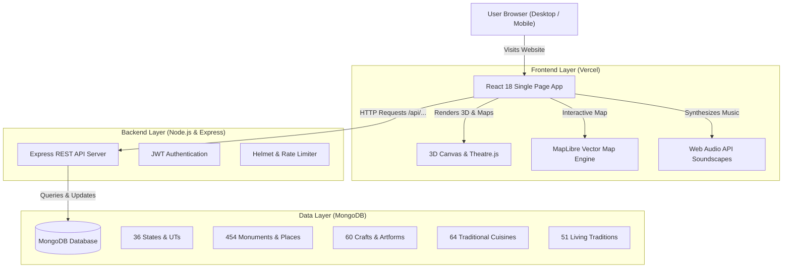

# Bharat Darshan — Comprehensive Technical Report

**Project Name:** Bharat Darshan (Heritage & Culture Platform of India)  
**Target Event / Objective:** Smart India Hackathon (SIH) — Digital Heritage, Cultural Exploration & Tourism  
**Live Production Frontend:** [https://frontend-five-lilac-74.vercel.app](https://frontend-five-lilac-74.vercel.app)  
**Report Date:** September 2026  

---

## 1. Executive Summary

**Bharat Darshan** is a modern, interactive digital portal celebrating the rich heritage, traditions, handicrafts, and culinary diversity across all **28 States and 8 Union Territories** of India. 

The platform bridges the gap between historical preservation and modern technology by combining **3D visualizations**, **interactive vector maps**, **procedural Indian classical soundscapes**, **social media engagement (views & likes)**, and an **intelligent multi-modal travel itinerary planner ("My Yatra")**.

The platform is designed to be **visually stunning ("cinematic")**, **lightning fast**, and **accessible to any user on both desktop and mobile devices**.

---

## 2. High-Level Architecture

The platform follows a **decoupled Client-Server (Full-Stack) Architecture**:

---

## 3. Technology Stack (In Simple Terms)

### A. Frontend (What the User Sees & Interacts With)

| Technology | What It Is | Why We Used It (In Simple Words) |
| :--- | :--- | :--- |
| **React 18** | UI Component Library | Allows building fast, interactive pages where parts of the screen update smoothly without refreshing the entire page. |
| **Vite 5** | Build Tool & Bundler | Makes development instant and bundles code into ultra-lightweight, minified files that load in under 1 second. |
| **Tailwind CSS** | Styling Framework | Enables modern, responsive styling with clean color palettes (saffron, gold, royal navy, deep emerald) and dark-mode glassmorphism. |
| **Three.js & React Three Fiber** | 3D Graphics Engine | Displays interactive 3D monument models and atmospheric particle effects directly inside web browsers using WebGL (hardware accelerated). |
| **Theatre.js** | Visual Animation Studio | Provides cinematic camera motion and smooth transitions when moving between 3D scenes. |
| **MapLibre GL** | Vector Map Engine | Renders an interactive map of India with custom state boundary highlights, monument markers, and zoom animations without costly third-party map fees. |
| **Web Audio API** | Browser Audio Synthesizer | Generates procedural, meditative Indian classical soundscapes (Tanpura drone, temple bells, flute resonance) using mathematical sound waves—**zero audio files to download, zero lag**. |
| **Lucide Icons** | SVG Icon Library | Crisp, modern icons for navigation, transport, search, and social actions. |

---

### B. Backend (The Brain & API)

| Technology | What It Is | Why We Used It (In Simple Words) |
| :--- | :--- | :--- |
| **Node.js** | JavaScript Runtime | Runs the server code efficiently, handling hundreds of simultaneous requests with non-blocking I/O. |
| **Express.js** | Web Framework | Sets up clean, organized REST API routes (e.g., `/api/places`, `/api/states`, `/api/interactions/like`). |
| **Mongoose ODM** | Database Modeling Tool | Translates JavaScript objects into structured database documents, ensuring clean data schemas and automated validation. |
| **Helmet & Express Rate Limit** | Security Middlewares | Protects the server against web attacks (cross-site scripting, clickjacking, brute-force spamming). |
| **JSON Web Tokens (JWT)** | User Authentication | Keeps user sessions secure so users can log in and save their personalized travel itineraries. |

---

### C. Database (Where Information Lives)

| Technology | Detail | Simple Explanation |
| :--- | :--- | :--- |
| **MongoDB** | NoSQL Document Database | Stores heritage data as flexible JSON documents. Perfect for rich cultural records where each monument has varying attributes (timings, coordinates, historical eras, architectural styles). |

---

## 4. Complete Feature Breakdown

### 1. The Heritage Catalog (629 Curated Entities)
* **36 States & Union Territories**: Comprehensive cultural profiles covering history, capitals, regional tips, and emblems.
* **454 Heritage Places & Monuments**: From UNESCO World Heritage Sites (Taj Mahal, Sun Temple Konark, Hampi) to hidden gems across the Northeast and tribal heartlands.
* **60 Traditional Handicrafts & Textiles**: Madhubani art, Pashmina weaving, Dhokra brass casting, Blue Pottery, etc.
* **64 Regional Traditional Cuisines**: Signature dishes, preparation history, and cultural roots.
* **51 Living Traditions & Festivals**: Classical dance forms (Kathakali, Bharatanatyam), sacred rituals, and folk festivals.

### 2. Social Engagement System (Views & Likes)
* **Zero Initialized**: All items start at genuine baselines (0 views, 0 likes).
* **Accurate +1 View**: When a user clicks and reads a monument or craft page, the server atomically increments its view count by exactly 1.
* **Interactive Like Toggle**: Users can click the Heart button on any card or detail page to like/unlike. It updates the database in real time and remembers their liked items in local storage.
* **"My Heritage Diary" Drawer**: A slide-over panel accessible from the top navigation displaying all saved and liked landmarks in one place.

### 3. "My Yatra" Smart Transit & Trip Planner
* **User Origin Detection**: Allows users to automatically detect their current departure location via GPS (`navigator.geolocation`) or pick from major Indian hubs (Delhi, Mumbai, Bengaluru, Kolkata, Chennai, Hyderabad, etc.).
* **Distance Calculation**: Uses the mathematical **Haversine Formula** to calculate real-world spherical distances (in kilometers) between the user's city and the destination monuments.
* **Multi-Modal Transit Recommendations**:
  * **Short distances (< 350 km)**: Recommends Volvo / Express Intercity Buses and Regional Express Trains.
  * **Medium distances (350 – 900 km)**: Recommends Vande Bharat / Superfast Express Trains and Domestic Flights.
  * **Long distances (> 900 km)**: Recommends Direct Flight Routes and Rajdhani/Tejas Rail networks.
* **1-Click Direct Booking & Schedules**:
  * **Google Flights**: Pre-fills departure, arrival airport, and search parameters.
  * **ConfirmTkt / IRCTC**: Direct link to train schedules between relevant station codes.
  * **RedBus**: Pre-fills intercity bus route schedules.
  * **Google Maps Transit**: 1-click turn-by-turn multi-stop transit route.

### 4. Cinematic & Sensory Enhancements
* **Procedural Soundscapes**: Ambient background music synthesizer with presets: *Temple Serenity*, *Royal Sitar Resonance*, and *Vedic Bamboo Flute*.
* **Picture-in-Picture (PiP) Virtual Tours**: When scrolling through long historical narratives, the video tour smoothly lifts into a floating mini-player in the bottom corner so the visual experience is never interrupted.
* **Atmospheric Gold Dust**: HTML5 Canvas particle system simulating gentle floating golden embers across heritage cards and hero sections.

### 5. Instant Omnisearch (`Ctrl + K` Command Palette)
* Pressing `Ctrl + K` (or tapping the search bar) summons a global keyboard-navigable command center to instantly jump to any state, monument, craft, or recipe in milliseconds.

### 6. Side-by-Side State Comparison (`/compare`)
* Allows comparing any two Indian States or Union Territories side-by-side: monument count, popular handicrafts, staple dishes, capitals, and optimal travel seasons.

---

## 5. Security & Performance Highlights

1. **Sub-Second Page Loads**: Assets are code-split, preloaded, and compressed using modern ES module builds.
2. **Single Page Application (SPA) Resilience**: All deep-link paths (`/places/:id`, `/compare`, `/explore`) route through Vercel's rewrite engine without 404 breaks.
3. **Database Performance**: Indexed queries on MongoDB collections ensure instantaneous response times even when filtering hundreds of monuments.
4. **Data Protection**: Automated one-click backup engine (`backup-site.js`) archives source code and database snapshots to timestamped packages.

---

## 6. Deployment Architecture

| Layer | Hosting Provider | Deployment Status | Details |
| :--- | :--- | :--- | :--- |
| **Frontend UI** | **Vercel** | ✅ **Live in Production** | Hosted on edge servers worldwide with automatic SSL, caching, and CI/CD at `https://frontend-five-lilac-74.vercel.app`. |
| **Backend API** | **Render / Railway / Serverless** | 🔄 Ready for deployment | Clean Node/Express server ready to connect to Vercel via `VITE_API_URL`. |
| **Cloud Database** | **MongoDB Atlas** | 🔄 Ready for 1-click seed | Cloud document cluster configuration with 1-click seeding script. |

---

## 7. Conclusion

Bharat Darshan is a complete, production-grade cultural exploration platform. By combining high-fidelity 3D graphics, sound synthesis, real-world transit planning, and rich cultural scholarship, it offers an engaging and technologically advanced showcase of India’s timeless heritage.
